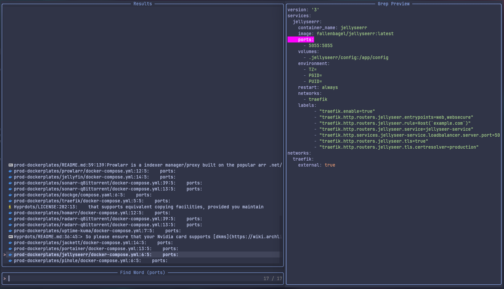
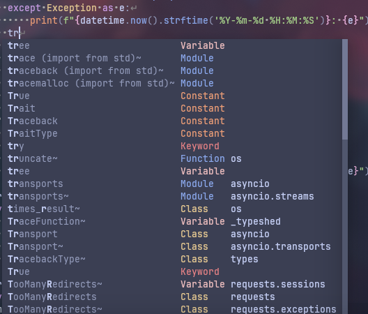

# Neovim to LSP

> [!WARNING]
> If you read this keep in mind that this config is tailored for my needs with plugins and shortcuts. Also I use `Neovide` not Neovim for the animated cursor so Neovim is broken with this config.

For the time being this repo is private because it contains sensitive code.

## Important cp
Install Neovim & Neovide.
```
sudo pacman -S neovim neovide
```

Set environment variables for config location.
```
export XDG_CONFIG_HOME=~/.config/
export XDG_CONFIG=~/.config/
```

Install packer plugin manager.
```
git clone --depth 1 https://github.com/wbthomason/packer.nvim\
 ~/.local/share/nvim/site/pack/packer/start/packer.nvim
```

> Put this in .zshrc if you will
```
alias vim='neovide'

```

## Showcase
### `Nvim-tree` + `Barbar tabs` and split screen coding capabilities
Toggle the file tree with a shortcut, navigate your directory and start coding, If you want to look up something or write code in multiple files there is a shortcut for splitting the screen horizontally/vertically.


### `Telescope` aka fuzzyfinder
Big projects are a pain in the butt to navigate between files, this plugin is a fuzzyfinder integration for Neovim to go between files faster.


### `Grep string` 
Telescope let's you search for a string in all the files inside your opened directory. After the search results you can preview the code part containing the string you searched for before opening a file for editing.



### "`Harpoon` man"
Harpoon is probably the fastest way to navigate files. Save the files you are currently working on in a buffer and switch between them with shortcuts. Insanely fast.


### `Zero LSP`
Install your favorite LSP servers for your languages and enjoy the code autocompletion.



### `Toggle term`
Toggle the terminal window with a shortcut whenever you are in need of a terminal instead of opening an entirely new terminal taking up space on your screen just to close it afterwards.


## Other Resources

- [Dockerplates](https://github.com/somedayitwillend/prod-dockerplates) - Docker-compose templates for your homelab.
